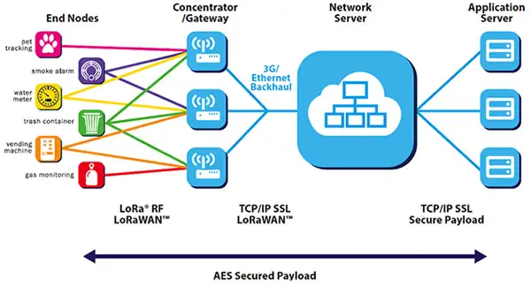

# Bauanleitung GPS-Tracker (optimized)
## Workshop vom 18. September 2019

Nach einem erfolgreichen ersten Workshop zum Thema LoRa und GPS haben wir uns kurzer Hand für einen weiterführenden, zweiten Workshop zum Thema entschieden. In diesem Workshop sollen die Vorzüge von beiden Versionen des ersten Workshops – sehr **kleines Packmaß mit Batteriestromversorgung (Version 1)** mit der **LoRa-Funktion (Version 2) kombiniert** werden. Dazu nutzen wir den bereits exitierenden Schaltplan von Version 1 (Nano mit kleinem Display), entfernen das Display und ersetzen es durch ein eine **Dragino LoRa Bee**. Die Verkabelung und der Code muss natürlich entsprechend angepasst werden – aber dazu später mehr.

#### Hardware 

Für die, nennen wir sie mal "Master-Version", benötigen wir die folgenden Hardware-Komponenten:
* 9V Batterien + Ladegerät (Bestellung [HIER](https://www.amazon.de/Ladeger%C3%A4t-Keenstone-aufladbare-Batterien-USB-Ladekabel-6-St-3-Slots-Ladegeraet/dp/B07BRKJV3J/ref=sr_1_2?__mk_de_DE=%C3%85M%C3%85%C5%BD%C3%95%C3%91&keywords=9+volt+batterie+800mAh+keenstone&qid=1568196073&s=computers&sr=8-2) möglich)

* Battericlip (Bestellung [HIER](https://www.amazon.de/KEESIN-Batterieknopf-2-1x5-5mm-Netzstecker-Batteriehalter/dp/B06Y41ZRVJ/ref=sr_1_4?__mk_de_DE=%C3%85M%C3%85%C5%BD%C3%95%C3%91&keywords=batterieclips&qid=1568195706&s=computers&sr=1-4) möglich)

* GPS-Modul mit Antenne (Bestellung [HIER](https://www.az-delivery.de/products/neo-6m-gps-modul?_pos=3&_sid=1c09a6176&_ss=r&ls=de) möglich)

* Arduino Nano (Bestellung [HIER](https://www.amazon.de/AZDelivery-Atmega328-gratis-Arduino-kompatibel/dp/B078S8BJ8T/ref=sr_1_9?__mk_de_DE=%C3%85M%C3%85%C5%BD%C3%95%C3%91&keywords=arduino+nano&qid=1568196529&s=ce-de&sr=1-9) möglich)

* LoRa Bee (Bestellung [HIER](https://www.exp-tech.de/module/wireless/funk/7769/dragino-lora-bee-868) möglich)

Zusammengerechnet kommen wir pro Tracker auf Kosten von 30€ und liegen damit weit unter dem Preis der gängigen GPS-Tracker (mit SIM-Karte), die i.d.R. bei 50€ anfangen.  

**Nice-To-Know:** der uns preiswerteste, bekannte GPS-Tracker (mit LoRaWAN) liegt bei 85€.

 
## First Things First: How To "Datenübertragung"

#### Via Mobilfunknetz und Internet
An dieser Stelle ein Hinweis: die konventionellen GPS-Tracker, wie man sie bei den einschlägigen Online-Händlern findet, nutzen das **Mobilfunknetz** und – ähnlich wie ein Handy – das Internet zur Daten- bzw. GPS-Koordinatenübertragung. Demnach ist für die Benutzung solcher Tracker eine eigene SIM-Karte für den Tracker unerlässlich. Vorteil hier, ist dass via Internet unter Nutzung von **Internetprotokollen wie TCP/IP und UDP** extrem Große Datenmengen (Stichwort: Breitband) mit extremer Geschwindigkeit übertragen werden können. Die Reichweite ist jedoch begrenzt. Durch die Kombination mit dem Mobilfunknetz (SIM-Karte) stellt die Reichweite zwar kein Problem mehr dar, jedoch verbrauchen diese Tracker sehr viel Leistung/Strom.  

#### Via LoRaWAN
Unser GPS-Tracker hingegen benutzt, wie der Name schon verrät, das **Low Range Wide Area Network**, welches zur Kategorie der Low-Range-Power-Netzprotokolle gehört, zur Übertragung der Daten. Also ein komplett anderes Netzprotokoll, welches speziell für die **drahtlose** Datenübertragung von **kleinen Datenmengen** (von 292 Bit/s bis 50 kbit/s), über **große Distanzen** (bis zu über 15km) zu verschiedensten, oft **batteriebetriebenen** Nodes, repektive Knotenpunkten, konzipiert wurde. Darüber hinaus weißt LoRa eine hohe Kapazität auf: bis zu **eine Million Knoten pro Anwendung** sind denkbar. Die LoRa-Technologie wird im sog. ISM-Band (Industrial, Scientific und Medical Frequenzbereich) bei 868 Megahertz in Europa und 915 MHz in Nordamerika betrieben. 

Viele **Internet of Things Anwendungen** (bspw. für Straßenbeleuchtung, Wetterstationen, etc.) und deren dazugehörigen Sensorknoten nutzen bereits seit Anfang der 2000er das LoRaWAN zur Datenübertragung. Die Nutzung ist kostenlos und kann sehr einfach über eine eigene, persönliche Applikation auf [**The Things Network**](https://www.thethingsnetwork.org/) verwaltet werden. Dazu aber später mehr.  

Der Aufbau des LoRaWAN ist recht simpel (siehe nachfolgendes Image). Wobei gilt:
* Endnode == unser GPS-Tracker
* Gateway(s) == können auf [https://ttnmapper.org/](https://ttnmapper.org/) gefunden werden
* Network-Server == Nutzung von The Thing Network
* Application Server == unsere Applikation auf dem Server von TTN.

Wer neugierig geworden ist und mehr über das LoRaWAN erfahren möchte, dem empfehlen wir die Website [https://www.lora-wan.de/](https://www.lora-wan.de/) zur weiteren Recherche. Aber nun, weiter im Text.

#### Verkabelung

Die einzelnen Hardware-Komponenten müssen wie folgt miteinander verkabelt werden. Für die Stromversorgung haben wir uns in unserem Schaltplan für eine 9V Batterie entschieden, das Board kann aber auch ohne Probleme mit dem Mini-USB-Kabel per Computer versorgt werden.

Inspiration dazu haben wir auf [Björns Techblog](https://www.bjoerns-techblog.de/2017/07/mein-erster-lowcost-lorawan-node/) gefunden. Danke, Björn.

