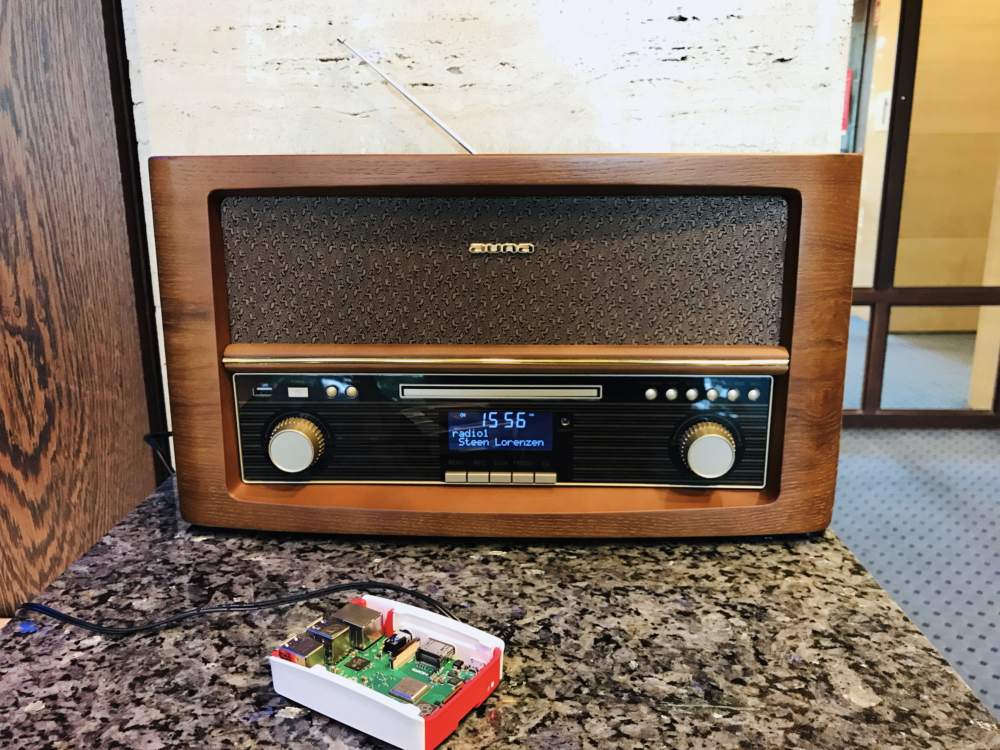

&nbsp;
# Bauanleitung Web Radio

In dieser Bauanleitung wollen wir zeigen, wie man aus einem Bluetooth fähigen Radio und einem Raspberry Pi 3 ein Web Radio baut. Genauer: konfiguriert. Denn geabut wurde das Radio ja schon.

#### Die Idee
Man nehme ein Bluetooth fähiges Radio. In Unserem Falle handelt es sich um ein **auna Belle Epoque 1906** mit Bluetooth-Funktion, USB-Anschluss und Fernebdienung. Was das Radio leider nicht hat: ein **WIFI-Adapter**. Die gute Nachricht: bei dem verwendetem Raspberry Modell Nummer 3 ist wurde ein boardinternes Chipset für WIFI und Bluetooth verbaut, sodass wir keine zusätzlichen Komponenten benötigen.

#### Hardware
* ein beliebiges Radio **mit Bluetooth-Funktion**
* Raspberry Pi 3 + SD-Karte + Netzteil (https://www.rasppishop.de/RPi3-A-Plus-Bundle)
* (wahlweise ein Arduino Uno WIFI (https://store.arduino.cc/arduino-uno-wifi-rev2))

In dieser Bauanleitung arbeiten wir mit dem Raspberry Pi 3. Wer lieber mit dem Arduino arbeitet und/oder ein paar Euro sparen möchte, der kann das Radio mit einem Arduino Uni WIFI (built-in WIFI) konfigurieren. Die Commands dafür werden hier erläutert.

#### Software 

## Version 1: GPS-Tracker mit kleinem OLED-Display
