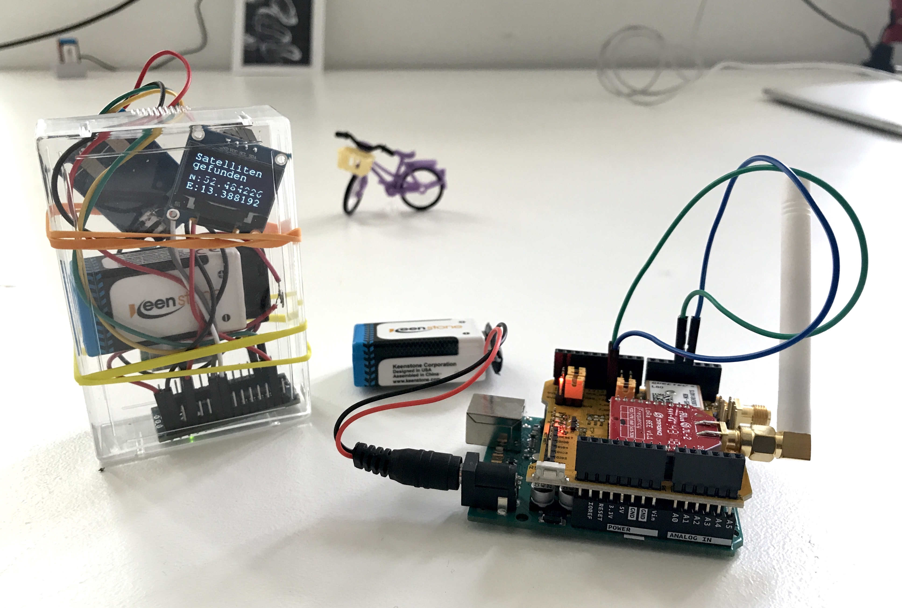

# Bauanleitung GPS-Tracker

Der Arduino Uno (https://store.arduino.cc/arduino-uno-rev3) ist ein Mini-Computer, der sich Dank der Arduino-Umgebung sehr leicht programmieren lässt. Wir haben den Arduino mit Hilfe von einem einem GPS-Modul, einem LCD bzw. OLED-Display und einem LoRa-Shield ein wenig Leben eingehaucht. Dabei haben wir insgesamt drei Versionen eines GPS-Trackers gebaut:
* Version 1: Arduino Uno + NEO 6M GPS-Modul + 0.96" I2C OLED-Display
* Version 2: Arduino Nano + NEO 6M GPS-Modul + Grove LCD 
* Versio 3: Arduino Uno + LoRa GPS Shield with LoRa BEE (Datenübertragung über LoRaWan mögliche)

Nachfolgend soll das Setup von Version 1 beschrieben werden.

Aber zu aller erst sind wir einmal neugierig und wollen euch gerne zwei Fragen stellen.
Wir würden uns sehr freuen, wenn ihr euch 2min Zeit nehmt und uns sagt, zu welchen Zwecken Eurer Meinung nach ein GPS-Tracker privat aber auch in einer Smart City genutzt werden kann und sollte. Wir werden versuchen Eure Antworten in kommenden Workshops zu berücksichtigen :)
Hier geht's zum Fragen-Sheet: [Klick mich!](https://github.com/technologiestiftung/workshops/blob/master/GetCreative.md)

## Version 1: GPS-Tracker mit kleinem OLED-Display

Welche Hardware man für diese Version benötigt:
* Arduino Uno Rev3 à 20€ (https://store.arduino.cc/arduino-uno-rev3)
* NEO 6M GPS-Modul à 8€ (https://www.az-delivery.de/products/neo-6m-gps-modul?ls=de&cache=false)
* 0.96" I2C OLED-Display  à 5€ (https://www.az-delivery.de/products/0-96zolldisplay?_pos=3&_sid=10138dee5&_ss=r&ls=de)
* ein paar Kabel à 3€ (https://www.az-delivery.de/products/3er-set-40-stk-jumper-wire-m2m-f2m-f2f?_pos=1&_sid=88ced2339&_ss=r&ls=de)

Der Gesamtpreis für die Hardware für GPS-Tracker Version 1 liegt damit bei 36 Euro.

Jedes einzelne Modul muss natürlich irgendwie über den Arduino angesteuert werden. Demnach benötogt man für bestimmte Module auch bestimmte Libraries, die in den Programmcode in den Präprozessor (also ganz am Anfang des Codes) durch das Schlüsselwort #include eingebunden werden müssen. Für diese Version haben wir 3 zusützliche Libraries eingebunden, die nicht per default über Arduino bereitgestellt werden. Das sind:
* https://github.com/adafruit/Adafruit-GFX-Library
* https://github.com/adafruit/Adafruit_SSD1306
* https://github.com/mikalhart/TinyGPSPlus (im Ordner src)

Anderes Beispiel mit einem sehr schick gestaltetem Display: https://robotzero.one/arduino-neo-gps-oled/
Die dtostrf-Funktion erklärt: https://www.mikrocontroller.net/topic/86391

## First things first: das OLED-Display 

Das OLED-Display wird über die Adafruit GFX Grpahics Library angesteuert.
Ausführliches Erläuterungen zu den einzelen Funktionen findet man [im offiziellen Guide](https://learn.adafruit.com/adafruit-gfx-graphics-library?view=all)
